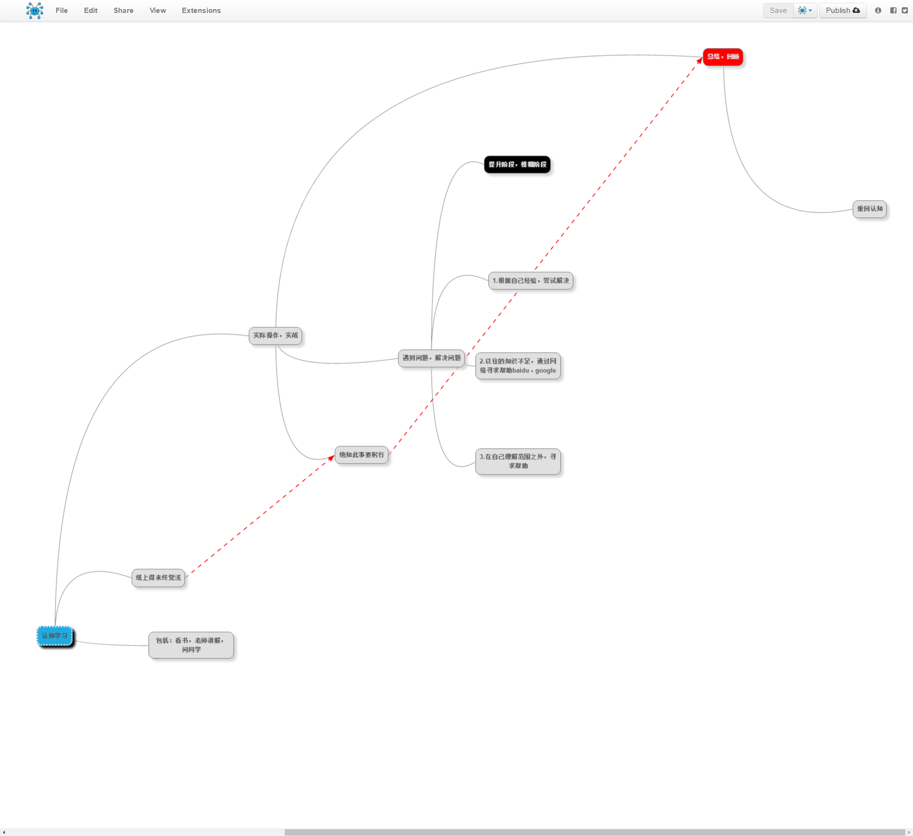
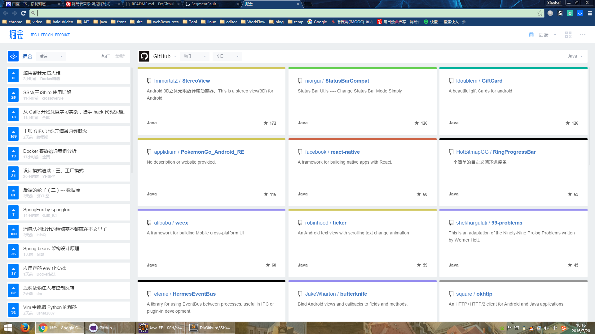

## 框架组合说明
[学习路线](https://atlas.mindmup.com/2016/07/fe65af60304c013445fc1f4e1c74df87/map/index.html)

[Hibernate注解总结](http://www.imooc.com/article/8815)

#### 推荐的资源
[https://segmentfault.com/](https://segmentfault.com/)

掘金插件

